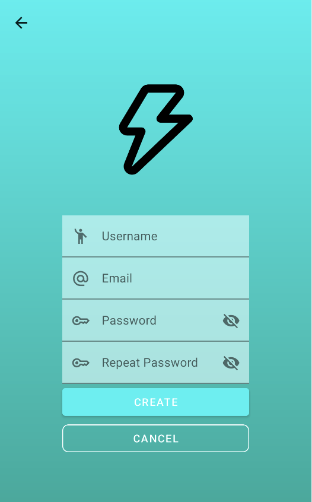
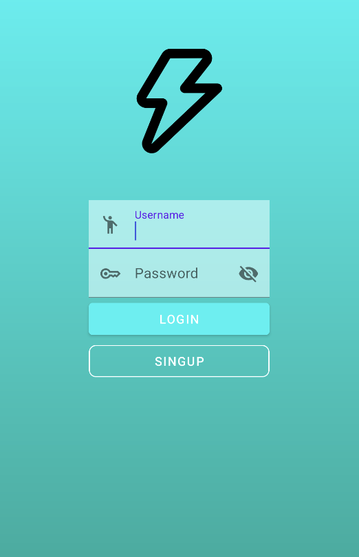
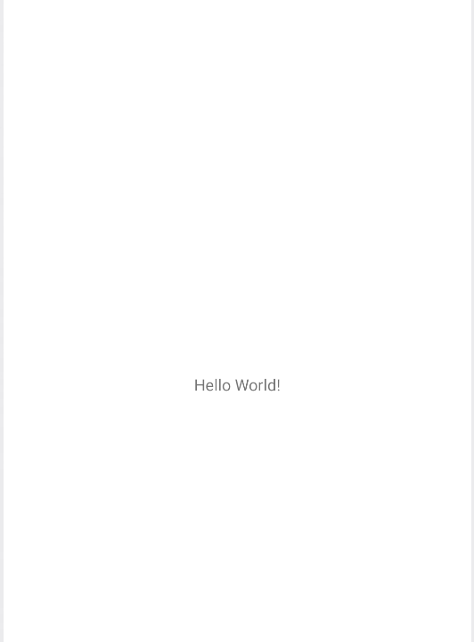

## Descripción

Aquí se encuentran el código fuente (Java), los recursos (layouts, drawables, valores), de la aplicacion `NiceStrat`.

   

## Requisitos

- JDK (11+ recomendado, según configuración del proyecto).
- Android Studio (obligatorio). 

## Color Reference

| Color             | Hex                                                                |
| ----------------- | ------------------------------------------------------------------ |
| LightBlue1 |  #07F2F2 |
| LightBlue2 |  #05F2DB |
| DarkBlue1 |  #03A696 |
| DarkBlue2 |  #027368 |
| Brown |  #26110F |

## Estructura principal

- `src/main/java/Login.java` - código fuente del backend de la ventana asociada al inicio de sesion.
- `src/main/java/MainActivity.java` - código fuente del backend de la vista principal.
- `src/main/java/SingUp.java` - código fuente del backend de la ventana asociada al registro de una cuenta nueva.
- `src/main/java/Splash.java` - código fuente del backend de la ventana que sale nada mas abrir la aplicacion.
- `src/main/res/layout/activity_login.xml` - Aqui se encuentra el codigo del frontent de la ventana asociada al inicio de sesion.
- `src/main/res/layout/activity_main.xml` - Aqui se encuentra el codigo del frontent de la vista principal.
- `src/main/res/layout/activity_sing_up.xml` - Aqui se encuentra el codigo del frontent de la ventana asociada al registro de una cuenta nueva.
- `src/main/res/layout/activity_splash.xml` - Aqui se encuentra el codigo del frontent de la vista principal.
- `src/main/AndroidManifest.xml` - manifest del módulo.

## Cómo contribuir

1. Crea un branch con un nombre descriptivo (por ejemplo `feature/nombre` o `fix/descripcion`).
2. Abre un Pull Request hacia la rama destino (ej. `develop` o `main`) con una descripción clara de los cambios.
4. Incluye screenshots o pasos para reproducir si el cambio afecta la UI.

---
